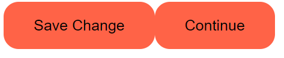
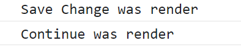
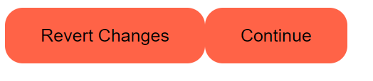
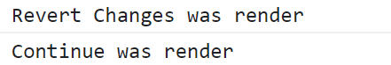
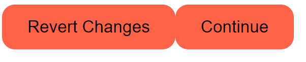
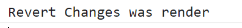

# React 강의자료

## 1. THE BASICS OF REACT

#### 1) Introduction

- React JS는 UI를 interactive하게 만들어줌. (웹사이트에 상호작용을 만들어줌)


#### 2) React JS의 특징

```html
<!DOCTYPE html>
<html lang="en">
  <body>
    <div id="root"></div>
  </body>
  <script src="https://unpkg.com/react@17.0.2/umd/react.production.min.js"></script>
  <script src="https://unpkg.com/react-dom@17.0.2/umd/react-dom.production.min.js"></script>
  <script>
    const root = document.querySelector("#root");
    const span = React.createElement("span", {id:"sexy-span"}, "Hello I'm a span.");
    ReactDOM.render(span, root);
  </script>
</html>
```

- React JS: 어플리케이션이 아주 interactive 하도록 만들어주는 library.
- ReactDOM: 모든 React element들을 HTML body에 둘 수 있도록 해줌.

- render: React element를 가지고 HTML로 만들어 배치한다. (사용자에게 보여준다)

- 강의의 요점: ==React JS는 우리가 해왔던 방식을 거꾸로 한다.==
  - 바닐라 JS: HTML - JavaScript - HTML
  - React: JavaScript - HTML
  - __JavaScript를 이용해 element를 생성했고 React JS가 그걸 HTML로 번역__


#### 3) Events in React

```javascript
const btn = React.createElement(
  "button", 
  {
    onClick: () => console.log("I'm clicked."),
  }, 
  "Click me"
);
```

- 이 하나의 statement만으로 HTML을 만들고 content도 넣고, event listener도 등록.
- Interactive한 어플리케이션에서 하는 작업들 모두가 event들을 감지하는 것이기 때문에 addEventListener를 반복하는 대신 property에서 event를 등록할 수 있게 함


#### 4) JSX

```javascript
<script src="https://unpkg.com/@babel/standalone/babel.min.js"></script>
<script type="text/babel">
  const Title = (
    <h3 id="title" onMouseEnter={() => console.log("mouse enter")}>
      Hello I'm a Title.
    </h3>
  );
</script>
```

- JSX: HTML에서 사용한 문법과 흡사한 문법을 가지면서 React 요소를 만들어줌
- Babel: 브라우저가 온전히 JSX를 이해하는 것은 아니기 때문에 브라우저가 JSX를 이해할 수 있도록 babel 설치


```javascript
const Container = () => (
  <div>
    <Title />
    <Button />
  </div>
);
ReactDOM.render(<Container />, root)
```

- Title과 Button(React Element)를 Container에 포함시키기 위해 할 일

  1. Title과 Button을 함수로 만들어준다.

     ```react
     function Title () {
       return (
         <h3 id="title" onMouseEnter={() => console.log("Mouse Enter.")}>
           Hello I'm a title
     	</h3>
       );
     }
     const Button = () => (
      <button 
         style={{
           backgroundColor: "tomato",
         }} 
         onClick={() => console.log("I'm clicked.")}
       >
         Click me
       </button>
     )
     ```

  2. 마치 일반적인 HTML 태그인 것처럼 포함시켜주기

     - ==컴포넌트의 첫 글자는 반드시 대문자==
     - 만약 소문자면 React랑 JSX는 이게 HTML button 태그라고 생각

     ```react
     const Container = () => (
       <div>
         <button>Hello</button>
       	<Title />
         <Button />
       </div>
     );
     ReactDOM.render(<Container />, root);
     ```

     


## 2. STATE

#### 1) 기본

- state: 기본적으로 데이터가 저장되는 곳.

- 변수를 JSX로 전달하는 방법

  ```react
  let counter = 0;
  const Container = () => (
   <h3>Total clicks: {counter}</h3>
  )
  ```

- 값이 바뀔때마다 UI를 업데이트하고 싶으면 리렌더링을 해줘야 함.

  ```react
  let counter = 0;
  function countUp() {
    counter = counter + 1;
    // 데이터를 업데이트할 때마다 리렌더링을 해줘야 한다.
    render();
  }
  function render() {
    ReactDOM.render(<Container />, root);
  }
  const Container = () => (
    <div>
      <h3>Total clicks: {counter}</h3>
      <button onClick={countUp}>Click me</button>
    </div>
  );
  render();
  ```

- React.js의 장점

  ​	바닐라 JS																					React.JS

  

​		React.js는 새로 렌더링하더라도 전체를 전부 재생성할 필요 없이 바뀐 부분만 새로 생성할 수 있게 해준다.

​		이전에 렌더링된 컴포넌트는 어떤거였는지 확인하고 다음에 렌더링될 컴포넌트는 어떤지 보고 React.js는 다		른 부분만 파악한다. 같은 부분은 다시 생성하지 않고 오로지 바뀐 부분만 업데이트해준다. 

​		이를 통해 아주 Interactive한 어플을 만들 수 있음.


#### 2) setState

```react
function App() {
  const [counter, setCounter] = React.useState(0);
  const onClick = () => {
    setCounter(counter + 1);
  };
  return (
    <div>
      <h3>Total clicks: {counter}</h3>
      <button onClick={onClick}>Click me</button>
    </div>
  );
}
```

- React.useState()

  React.js 어플 내에서 데이터를 보관하고 자동으로 리렌더링을 해주는 방법

  ```react
  const [counter, setCounter] = React.useState(0);
  ```


​		첫번째 요소: 우리가 담으려는 data 값

​		두 번째 요소: 이 data 값을 바꿀 때 사용할 modifier(자동으로 리렌더링해준다.)

- 배열에서 요소들을 꺼내서 이름 부여하는 JavaScript 문법

  ```react
  const x = [1, 2, 3];
  const [a, b, c] = x;
  ```

modifier 함수를 이용해서 컴포넌트의 state를 바꿀 때 컴포넌트는 **새로운 값을 가지고 ==다시 한 번 렌더링==되는 것임!! **


#### 3) Value와 State 연결

```react
const [minutes, setMinutes] = React.useState(0);
const onChange = (event) => {
  setMinutes(event.target.value);
}

<input
  value = {minutes}
  onChange={onChage}
/>
```

value와 이벤트리스너 둘 다 추가해야 함.


#### 4) label - input 태그

```react
<label for="minutes">Minutes</label>
<input 
  value={inverted ? amount * 60 : amount} 
  id="minutes" 
  placeholder="Minutes" 
  type="number" 
  onChange={onChange}
  disabled={inverted}
/>
```

> 1. label의 for와 input의 id를 값은 값을 넣어서 연결
> 2. input에 value와 이벤트 리스너 


#### 5) select - option

```react
<div>
  <h1>Super Converter</h1>
  <select value={index} onChange={onSelect}>
    <option value="xx">Select your units</option>
    <option value="0">Minutes & Hours</option>
    <option value="1">Km & Miles</option>  
  </select>
  <hr />
  {index === "xx" ? "Please select your units" : null}
  {index === "0" ? <MinutesToHours /> : null}
  {index === "1" ? <KmToMiles /> : null}
</div>
```

> 1. select에 value와 이벤트 리스너
>
>    - onSelect 함수에서 index 값을 event.target.value로 바꿔줌
>
> 2. 각 option에서 value값 지정
>
> 3. if - else 문을 아래와 같이 사용
>
>    - {index === "0" ? <MinutesToHours /> : null} 
>
>      ==> index 값이 0 이면 MinutesToHours 컴포넌트 렌더링


## 3. Props

#### 1) Props

- 부모 컴포넌트로부터 자식 컴포넌트에 데이터를 보낼 수 있게 해주는 방법

- 예시, 한 회사에서 어플리케이션을 만들려고 함

  - 다양한 버튼들이 필요 (로그인, 변경, 확인 등등...)
  - 다양한 버튼이 있지만 버튼의 모습은 같음 ==> <span style="color:red">리액트 컴포넌트를 재사용하고 싶음</span>

- 재사용하기 전의 코드

  ```react
  function SaveBtn(){
    return <button style={{
      fontSize: 18,
    }}>Save Changes</button>
  }
  
  function ConfirmBtn(){
    return <button style={{
      fontSize: 16,
    }}>Confirm</button>
  }
  
  function App(){
    return (
      <div>
     	  <SaveBtn />
        <ConfirmBtn />
      </div>
    )
  }
  ```

- 재사용 코드

  ```react
  function Btn({text ,big}){
    return <button style={{
      fontSize: big ? 18 : 16,
    }}>{text}</button>
  }
  
  function App(){
    return (
      <div>
        //   
        <Btn text="Save Changes" big={true} />
        <Btn text="Confirm" big={false} />
      </div>
    )
  }
  ```


#### 2) Memo

- 부모 컴포넌트가 리렌더링

  ```react
  function Btn({text, changeValue}){
    return(
      <button onClick={changeValue}>
     	  {text}
      </button>
    );
  }
  
  function App(){
    const [value, setValue] = React.useState("Save Change");
    const changeValue = () => setValue("Revert Changes")
    return (
      <div>
        // 여기에 onClick해도 이벤트리스너가 아니라 props이름.
     	  <Btn text={value} changeValue={changeValue} />
        <Btn text="Continue" />
      </div>
    )
  }
  ```

  - 버튼 클릭 ==> 부모 컴포넌트 state(상태) 변경
  - 상태 변경 ==> 모든게 새로 렌더링
  - 버튼 누르기 전

  

  

  

  - 버튼 누른 후

  

  

- ==React Memo==

  - Props가 변경되지 않으면 리렌더링하지 않게 해줌

  ```react
  function Btn({text, changeValue}){
  }
  
  const MemorizedBtn = React.memo(Btn)
  function App() {
    return (
      <div>
        <MemorizedBtn />
        <MemorizedBtn />
      </div>
    )
  }
  ```

  




#### 3) Prop Types

- React props는 어떤 타입의 prop이든 보내줄 수 있음
- 문제는 잘못된 prop을 전달할 때도 리액트는 에러 메세지를 띄우지 않음
- ==PropTypes==로 해결가능

```react
<script src="https://unpkg.com/prop-types@15.7.2/prop-types.js"></script>

Btn.propTypes = {
  text: PropTypes.string,
  fontSize: PropTypes.number,
}
```

- 공식 문서: https://ko.reactjs.org/docs/typechecking-with-proptypes.html

- props 가 없을 때 기본값으로 설정하는 방법

  ```react
  function Btn({text, fontSize = 16}){
  }
  ```


## 4. 

