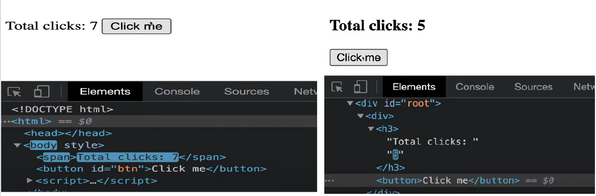
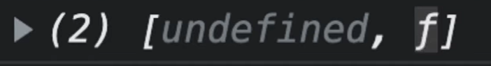

# React 강의자료

## 1. THE BASICS OF REACT

#### 1) Introduction

- React JS는 UI를 interactive하게 만들어줌. (웹사이트에 상호작용을 만들어줌)


#### 2) React JS의 특징

```html
<!DOCTYPE html>
<html lang="en">
  <body>
    <div id="root"></div>
  </body>
  <script src="https://unpkg.com/react@17.0.2/umd/react.production.min.js"></script>
  <script src="https://unpkg.com/react-dom@17.0.2/umd/react-dom.production.min.js"></script>
  <script>
    const root = document.querySelector("#root");
    const span = React.createElement("span", {id:"sexy-span"}, "Hello I'm a span.");
    ReactDOM.render(span, root);
  </script>
</html>
```

- React JS: 어플리케이션이 아주 interactive 하도록 만들어주는 library.
- ReactDOM: 모든 React element들을 HTML body에 둘 수 있도록 해줌.

- render: React element를 가지고 HTML로 만들어 배치한다. (사용자에게 보여준다)

- 강의의 요점: ==React JS는 우리가 해왔던 방식을 거꾸로 한다.==
  - 바닐라 JS: HTML - JavaScript - HTML
  - React: JavaScript - HTML
  - __JavaScript를 이용해 element를 생성했고 React JS가 그걸 HTML로 번역__


#### 3) Events in React

```javascript
const btn = React.createElement(
  "button", 
  {
    onClick: () => console.log("I'm clicked."),
  }, 
  "Click me"
);
```

- 이 하나의 statement만으로 HTML을 만들고 content도 넣고, event listener도 등록.
- Interactive한 어플리케이션에서 하는 작업들 모두가 event들을 감지하는 것이기 때문에 addEventListener를 반복하는 대신 property에서 event를 등록할 수 있게 함


#### 4) JSX

```javascript
<script src="https://unpkg.com/@babel/standalone/babel.min.js"></script>
<script type="text/babel">
  const Title = (
    <h3 id="title" onMouseEnter={() => console.log("mouse enter")}>
      Hello I'm a Title.
    </h3>
  );
</script>
```

- JSX: HTML에서 사용한 문법과 흡사한 문법을 가지면서 React 요소를 만들어줌
- Babel: 브라우저가 온전히 JSX를 이해하는 것은 아니기 때문에 브라우저가 JSX를 이해할 수 있도록 babel 설치


```javascript
const Container = () => (
  <div>
    <Title />
    <Button />
  </div>
);
ReactDOM.render(<Container />, root)
```

- Title과 Button(React Element)를 Container에 포함시키기 위해 할 일

  1. Title과 Button을 함수로 만들어준다.

     ```react
     function Title () {
       return (
         <h3 id="title" onMouseEnter={() => console.log("Mouse Enter.")}>
           Hello I'm a title
     	</h3>
       );
     }
     const Button = () => (
      <button 
         style={{
           backgroundColor: "tomato",
         }} 
         onClick={() => console.log("I'm clicked.")}
       >
         Click me
       </button>
     )
     ```

  2. 마치 일반적인 HTML 태그인 것처럼 포함시켜주기

     - ==컴포넌트의 첫 글자는 반드시 대문자==
     - 만약 소문자면 React랑 JSX는 이게 HTML button 태그라고 생각

     ```react
     const Container = () => (
       <div>
         <button>Hello</button>
       	<Title />
         <Button />
       </div>
     );
     ReactDOM.render(<Container />, root);
     ```

     


## 2. STATE

#### 1) Understanding State

##### (1) state: 기본적으로 데이터가 저장되는 곳.

##### (2) 변수를 JSX로 전달하는 방법

```react
let counter = 0;
const Container = () => (
 <h3>Total clicks: {counter}</h3>
)
```

##### (3) 값이 바뀔때마다 UI를 업데이트하고 싶으면 리렌더링을 해줘야 함.

```react
let counter = 0;
function countUp() {
  counter = counter + 1;
  // 데이터를 업데이트할 때마다 리렌더링을 해줘야 한다.
  render();
}
function render() {
  ReactDOM.render(<Container />, root);
}
const Container = () => (
  <div>
    <h3>Total clicks: {counter}</h3>
    <button onClick={countUp}>Click me</button>
  </div>
);
render();
```

##### (4) React.js의 장점

바닐라 JS																					React.JS



React.js는 새로 렌더링하더라도 전체를 전부 재생성할 필요 없이 바뀐 부분만 새로 생성할 수 있게 해준다.

이전에 렌더링된 컴포넌트는 어떤거였는지 확인하고 다음에 렌더링될 컴포넌트는 어떤지 보고 React.js는 다른 부분만 파악한다. 같은 부분은 다시 생성하지 않고 오로지 바뀐 부분만 업데이트해준다. 

이를 통해 아주 Interactive한 어플을 만들 수 있음.


#### 2) setState

```react
function App() {
  const [counter, setCounter] = React.useState(0);
  const onClick = () => {
    setCounter(counter + 1);
  };
  return (
    <div>
      <h3>Total clicks: {counter}</h3>
      <button onClick={onClick}>Click me</button>
    </div>
  );
}
```

##### (1) React.useState()

React.js 어플 내에서 데이터를 보관하고 자동으로 리렌더링을 해주는 방법

```react
const [counter, setCounter] = React.useState(0);
```



- 첫번째 요소: 우리가 담으려는 data 값
- 두 번째 요소: 이 data 값을 바꿀 때 사용할 modifier(자동으로 리렌더링해준다.)


##### (2) 배열에서 요소들을 꺼내서 이름 부여하는 JavaScript 문법

```javascript
const x = [1, 2, 3];
const [a, b, c] = x;
```


** modifier 함수를 이용해서 컴포넌트의 state를 바꿀 때 컴포넌트는 **새로운 값을 가지고 다시 한 번 렌더링되는 것임!! **

